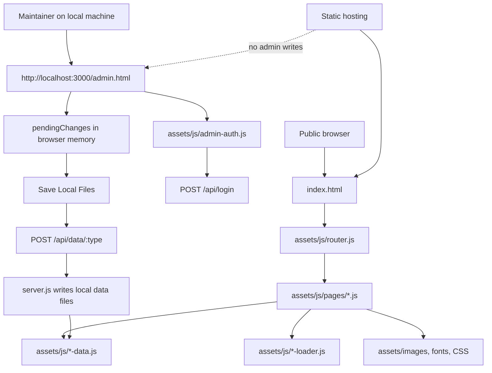

# Tridel Website Technical Documentation

> Audience: developers, maintainers, operators, and handoff teams.
> Scope: the public Tridel website, the localhost-only admin panel, the local Node server, the data files, security controls, crawler blocking, and deployment behavior.
> Important operating rule: the admin panel is a local tool. It is designed to work only from `localhost` / `127.0.0.1` and writes directly to local project files through `server.js`.

---

## 1. System Summary

This repository contains a static corporate website for Tridel Technologies plus a small local content-management server.

The public site is a browser-rendered single-page application. It uses HTML, CSS, vanilla JavaScript, local data files, local images, and a small set of browser libraries.

The admin panel is not a hosted production CMS. It is a local editing console for trusted maintainers. It requires the local Express server and refuses to operate from non-local hosts. Content changes are saved into local JavaScript data files such as `assets/js/products-data.js`, `assets/js/services-data.js`, and `assets/js/layout-data.js`.

There is no remote repository API integration in the admin panel. There are no repository tokens, remote commit calls, remote file writes, or remote content fetches in the admin workflow.

---

## 2. Architecture



The same data files power both the public site and the admin previews. This keeps hosting simple, but it means content structure matters: data files are treated as the source of truth.

---

## 3. Runtime Modes

### 3.1 Public Static Mode

Public visitors load:

- `index.html`
- `assets/css/styles.css`
- `assets/css/fonts.css`
- `assets/js/router.js`
- `assets/js/pages/*.js`
- `assets/js/*-data.js`
- image, font, and vendor assets under `assets/`

This mode can run from static hosting. It does not require Node.js for normal public browsing.

### 3.2 Local Admin Mode

Maintainers run:

```powershell
npm install
npm start
```

Then open:

```text
http://localhost:3000/admin.html
```

The local server binds to:

```text
127.0.0.1
```

That binding is deliberate. Other machines on the network should not be able to reach the admin API.

### 3.3 Remote Admin Mode

Remote admin mode is intentionally unsupported.

If `admin.html` is opened on a deployed domain, `assets/js/admin-auth.js` shows a local-only notice and does not expose the editing workflow. The admin panel needs the local server because edits must be written to local files, not to an external service.

---

## 4. Repository Map

| Path | Purpose |
|---|---|
| `index.html` | Public website shell and script load order |
| `admin.html` | Local admin shell |
| `server.js` | Local Express server, authentication, data-file writes, metrics |
| `package.json` | Node scripts and dependencies |
| `assets/css/styles.css` | Main public site styling |
| `assets/css/admin.css` | Admin interface styling |
| `assets/css/admin-auth.css` | Login and local-only notice styling |
| `assets/css/fonts.css` | Local font-face declarations |
| `assets/js/*-data.js` | Content data files used as the CMS data store |
| `assets/js/admin.js` | Main admin business logic |
| `assets/js/admin-auth.js` | Local-only guard and login flow |
| `assets/js/admin-publish.js` | Local save, reload, undo, and export actions |
| `assets/js/admin-ui.js` | Shared admin rendering helpers |
| `assets/js/admin-form-rows.js` | Admin form row builders |
| `assets/js/router.js` | Hash-based public route controller |
| `assets/js/pages/*.js` | Page renderers for public views |
| `assets/vendor/` | Vendored browser libraries |
| `assets/images/` | Public site imagery |
| `robots.txt` | Crawler policy |
| `_headers` | Netlify-style security and caching headers |
| `_redirects` | Netlify-style routing rules |
| `web.config` | IIS-style equivalent headers/routing |

---

## 5. Data Model

The site uses plain JavaScript data files instead of a database. Each file declares a constant:

```javascript
const PRODUCTS_DATA = [
  {
    id: "example-product",
    title: "Example Product",
    description: "Short public description",
    image: "assets/images/products/example.jpg"
  }
];
```

The browser scripts copy those constants onto `window` for compatibility with older code:

```javascript
window.PRODUCTS_DATA = PRODUCTS_DATA;
```

### 5.1 Main Data Files

| Admin type | Local file | Main variable | What it controls |
|---|---|---|---|
| `products` | `assets/js/products-data.js` | `PRODUCTS_DATA` | Product catalogue |
| `services` | `assets/js/services-data.js` | `SERVICES_DATA` | Services catalogue |
| `clients` | `assets/js/clients-data.js` | `CLIENTS_DATA` | Client logos |
| `stories` | `assets/js/success-stories-data.js` | `SUCCESS_STORIES_DATA` | Case studies and success stories |
| `home` | `assets/js/home-cards-data.js` | `HOME_CARDS_DATA` | Home-page cards |
| `linkedin` | `assets/js/linkedin-posts.js` | `NEWS_DATA` | LinkedIn/news embed list |
| `team` | `assets/js/team-data.js` | `TEAM_DATA` | Team section |
| `testimonials` | `assets/js/testimonials-data.js` | `TESTIMONIALS_DATA` | Testimonials |
| `locations` | `assets/js/locations-data.js` | `LOCATIONS_DATA` | Map locations |
| `settings` | `assets/js/contact-data.js` | `CONTACT_DATA` | Public contact address/social values |
| `form_settings` | `assets/js/settings-data.js` | `SETTINGS_DATA` | Form routing and feature flags |
| `index_content` | `assets/js/index-data.js` | multiple constants | Home page hero and section order |
| `about_content` | `assets/js/about-data.js` | `ABOUT_DATA` | About page sections |
| `contact_content` | `assets/js/contact-page-data.js` | multiple constants | Contact page cards, FAQ, page config |
| `layout` | `assets/js/layout-data.js` | multiple constants | Navigation, footer, metadata |

### 5.2 Multi-Constant Files

Some files contain several constants because one page needs several related structures.

`assets/js/layout-data.js` contains:

- `NAV_LINKS`
- `MEGA_MENU_CONFIG`
- `FOOTER_DATA`
- `PAGE_META`

`assets/js/contact-page-data.js` contains:

- `CONTACT_INFO_CARDS`
- `CONTACT_FAQ_DATA`
- `CONTACT_PAGE_CONFIG`

`assets/js/index-data.js` contains:

- `INDEX_HERO`
- `INDEX_WHY_CHOOSE`
- `INDEX_SECTION_ORDER`

The server and admin parser handle these files by reading exact assigned literals instead of using broad, greedy text matching. This keeps nearby constants from being accidentally merged together.

---

## 6. Public Website Flow

### 6.1 Initial Load

1. Browser requests `index.html`.
2. CSS and fonts load.
3. Data files load and define content constants.
4. Shared utilities load.
5. Layout, loader, and page-rendering scripts load.
6. `router.js` reads the hash route, such as `#/`, `#/products`, or `#/contact`.
7. The selected page renderer builds the page.
8. Section loaders hydrate repeated blocks.

### 6.2 Routing

The public site uses hash routing. This means routes live after `#`:

```text
https://example.com/#/
https://example.com/#/products
https://example.com/#/services
https://example.com/#/contact
```

Hash routing keeps static hosting simple because the server always serves `index.html`.

### 6.3 Layout

The layout system reads `NAV_LINKS`, `MEGA_MENU_CONFIG`, `FOOTER_DATA`, and `PAGE_META` from `assets/js/layout-data.js`.

Important behaviors:

- Navigation is data-driven.
- Mega menus are data-driven.
- Footer links and contact blocks are data-driven.
- Page metadata can be updated without editing page renderer code.

### 6.4 Theme

The public site has a light/dark theme toggle. The theme scripts use:

- local storage for user preference
- CSS custom properties for color tokens
- class or attribute changes on the root document/body

### 6.5 Smooth Scroll

The public site loads Lenis from:

```text
assets/vendor/lenis/lenis.min.js
```

It is used for smoother wheel and touch scrolling. The site should still work if smooth-scroll initialization fails.

---

## 7. Local Admin Flow

### 7.1 Admin Entry Point

The admin panel is:

```text
admin.html
```

In normal use it must be opened through the local Node server:

```text
http://localhost:3000/admin.html
```

Opening the file directly or opening it from a deployed domain is not the supported editing path.

### 7.2 Local-Only Gate

`assets/js/admin-auth.js` checks:

- `localhost`
- `127.0.0.1`
- `::1`
- `[::1]`

If the host is not local, the admin UI is replaced with a notice explaining that admin editing is local-only.

### 7.3 Authentication

The admin login posts to:

```text
POST /api/login
```

The server checks the submitted password using Node's `crypto.scryptSync` with a stored salt/hash value.

Sessions are:

- random token strings
- stored in server memory
- stored in browser `sessionStorage` as `adminToken`
- validated through the local `x-auth-token` request header

The browser also mirrors the token into `window.authToken` for admin modules that need to call local API routes.

### 7.4 Draft Editing

Admin edits first live in browser memory. They are marked using:

```javascript
pendingChanges.add(type)
```

This lets the maintainer edit several sections and then save them together.

### 7.5 Saving

The main button is:

```text
Save Local Files
```

It calls `publishAllChanges()` in `assets/js/admin-publish.js`.

For each pending content type:

1. The admin script collects the current in-memory payload.
2. The script maps the admin type to the server type.
3. It sends `POST /api/data/:type` with the local session token.
4. `server.js` validates and sanitizes the object.
5. `server.js` writes the matching local data file.
6. The admin clears that pending flag.

### 7.6 Reloading

The admin panel has a `Reload Local Data` action.

This refetches the local `assets/js/*-data.js` files with cache-busting query strings, parses the assigned constants, and refreshes the in-memory admin state.

Use this after manual file edits or after switching branches.

### 7.7 Exporting

The admin can export JSON snapshots from the browser. Exporting is only a backup/convenience operation. It does not update the live website and does not replace the local file save workflow.

---

## 8. Local API

All write routes require a valid local session token.

| Method | Route | Auth | Purpose |
|---|---|---|---|
| `GET` | `/api/health` | no | Health check |
| `POST` | `/api/login` | no | Create admin session |
| `POST` | `/api/logout` | yes | Destroy session |
| `GET` | `/api/check-auth` | yes | Confirm session token |
| `GET` | `/api/data/:type` | yes | Read parsed local data |
| `POST` | `/api/data/:type` | yes | Write one local data file |
| `GET` | `/api/all-data` | yes | Read all parsed local data |
| `POST` | `/api/save-all` | yes | Write a batch of local data |
| `GET` | `/api/dashboard/metrics` | yes | Read site metrics |
| `POST` | `/api/metrics/visit` | no | Record page visit |
| `POST` | `/api/metrics/enquiry` | no | Record enquiry event |

### 8.1 Content Type Mapping

The admin and server do not always use the exact same type names.

| Admin type | Server route type |
|---|---|
| `linkedin` | `news` |
| `settings` | `contact` |
| `form_settings` | `settings` |
| `visibility` | `settings` |
| all others | same name |

The mapping exists to preserve older server route names without changing the admin labels.

---

## 9. Server Implementation

### 9.1 Boot Sequence

`server.js` performs these major steps:

1. Load environment overrides from `.env` and `.env.local` if they exist.
2. Define local host and port.
3. Configure Express middleware.
4. Apply security headers.
5. Create authentication helpers.
6. Create file read/write helpers.
7. Register local API routes.
8. Serve static assets.
9. Bind to `127.0.0.1`.

### 9.2 Host Binding

The server starts with:

```javascript
const HOST = '127.0.0.1';
```

And listens with:

```javascript
app.listen(PORT, HOST, () => { ... });
```

This prevents the admin API from being exposed to the LAN by default.

### 9.3 Password Setup

The server supports an environment password:

```powershell
$env:TRIDEL_ADMIN_PASSWORD = "your-local-password"
npm start
```

If no password is configured, the server may generate a temporary local password at startup. Treat that as a development convenience, not as production identity management.

### 9.4 File Writes

File writes use the standard Node filesystem APIs:

- `fs.readFileSync`
- `fs.writeFileSync`
- `path.join`
- local path allowlisting

The server only writes known data files. It does not accept arbitrary paths from the browser.

### 9.5 Sanitization

Before saving, content passes through sanitization helpers. These helpers remove or normalize dangerous or unexpected values before the data is written back to JavaScript files.

This does not make arbitrary HTML safe. Public-facing rich text should still be treated carefully, and renderers should continue escaping user-controlled text with shared utilities.

---

## 10. Security Model

### 10.1 Main Security Boundaries

| Boundary | Control |
|---|---|
| Admin host | Browser guard in `admin-auth.js` |
| API network exposure | `server.js` binds to `127.0.0.1` |
| API access | Bearer session token |
| Password verification | `crypto.scryptSync` |
| Login abuse | in-memory login attempt limiter |
| Data writes | fixed type-to-file mapping |
| Browser injection | CSP headers and escaping helpers |
| Automated crawlers | `robots.txt`, `_headers`, `web.config`, meta directives |
| Third-party framing | `frame-src` allowlist |

### 10.2 Crawler and Bot Blocking

Crawler blocking uses layered controls:

1. `robots.txt` tells crawlers not to index the site.
2. `_headers` emits `X-Robots-Tag` directives for static hosting.
3. `web.config` provides equivalent headers for IIS-style hosting.
4. Page metadata can also contain noindex directives.

This is a search-engine and crawler policy layer. It is not an authentication layer. Sensitive admin behavior must remain behind the local-only server and session token.

### 10.3 Content Security Policy

The project keeps a strict allowlist for script, style, image, connection, and frame sources.

Important allowed external categories include:

- Font Awesome CDN for icons
- map tile providers for Leaflet maps
- LinkedIn/YouTube frames where embedded content is required
- FormSubmit when contact forms use that service

Remote repository API hosts are not part of the admin save flow.

### 10.4 Secrets

Do not put secrets in public files:

- not in `index.html`
- not in `admin.html`
- not in `assets/js/*.js`
- not in data files
- not in docs

Local admin passwords belong in environment variables or local ignored files.

---

## 11. Plugins and Libraries in the Runtime

This document only gives the operational view. The full inventory is in `TECHNOLOGIES_AND_PLUGINS.md`.

| Library or service | Used by | Local path or source | Role |
|---|---|---|---|
| Express | local server | npm dependency | API and static file server |
| CORS | local server | npm dependency | Local cross-origin header helper |
| SortableJS | admin | `assets/vendor/sortable/Sortable.min.js` | Drag-and-drop ordering |
| Lenis | public site | `assets/vendor/lenis/lenis.min.js` | Smooth scrolling |
| Leaflet | public locations | `assets/vendor/leaflet/` | Interactive map |
| Font Awesome | public/admin | CDN | Icons |
| LinkedIn embeds | public news | iframe embed URLs | Social/news content |
| FormSubmit | contact forms | external endpoint | Form delivery |

---

## 12. Deployment

### 12.1 Public Deployment

The public site can deploy as static files. Typical static deployment includes:

- `index.html`
- `404.html`
- `assets/`
- `_headers`
- `_redirects`
- `robots.txt`

The deployed public website does not need `npm start` for visitors.

### 12.2 Content Update Workflow

Recommended workflow:

1. Pull or open the current project locally.
2. Run `npm install` if dependencies are missing.
3. Start the server with `npm start`.
4. Open `http://localhost:3000/admin.html`.
5. Log in.
6. Edit content.
7. Click `Save Local Files`.
8. Review local file changes.
9. Deploy using the project's normal static deployment process.

The admin panel stops at local file edits. Publishing those edits to a hosting platform is outside the admin panel.

---

## 13. Troubleshooting

### Admin Page Says Local Admin Only

You opened `admin.html` on a deployed domain or non-local host. Use:

```text
http://localhost:3000/admin.html
```

### Login Says Server Unavailable

Start the local server:

```powershell
npm start
```

Then refresh the admin page.

### Save Button Does Nothing

Check:

- You are on `localhost`.
- You are logged in.
- The server is still running.
- The browser console has no syntax errors.
- The terminal running `server.js` has no write errors.

### Changes Save But Public Site Looks Old

Check:

- The changed data file actually changed.
- Browser cache is not showing an old file.
- The deployed host has received the new static files.
- The relevant loader reads the same variable that the admin writes.

### Map Does Not Render

Check:

- `assets/vendor/leaflet/leaflet.js` exists.
- `assets/vendor/leaflet/leaflet.css` exists.
- CSP allows the configured map tile host.
- The network is not blocking external map tiles.

### LinkedIn Embed Is Blocked

Check:

- Browser privacy settings.
- CSP `frame-src` entries.
- Whether the LinkedIn URL is embeddable.
- Whether the browser blocks third-party frames.

---

## 14. Verification Checklist

Run these after changing admin/server behavior:

```powershell
node --check server.js
node --check assets/js/admin-auth.js
node --check assets/js/admin.js
node --check assets/js/admin-publish.js
git diff --check
```

Manual checks:

- `http://localhost:3000/admin.html` shows the login screen.
- The login route accepts the configured local password.
- Non-local hosts show the local-only notice.
- `Save Local Files` writes local data files.
- `Reload Local Data` refreshes from disk.
- The public site still renders `#/`, `#/products`, `#/services`, `#/about`, and `#/contact`.
- Search the admin/server surface for removed remote repository workflow terms and confirm they are absent.

---

## 15. Maintenance Rules

1. Keep the admin local-only.
2. Keep data file names and constants synchronized.
3. Add new content types through an explicit allowlist.
4. Keep renderers escaping plain text.
5. Keep third-party hosts visible in `_headers` and `web.config`.
6. Prefer vendored libraries for critical UI behavior.
7. Do not introduce secret-bearing client-side configuration.
8. Treat `robots.txt` as crawler policy, not security.
9. Test with the local server before deploying static files.
10. Document every new plugin in `TECHNOLOGIES_AND_PLUGINS.md`.
