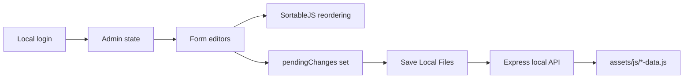
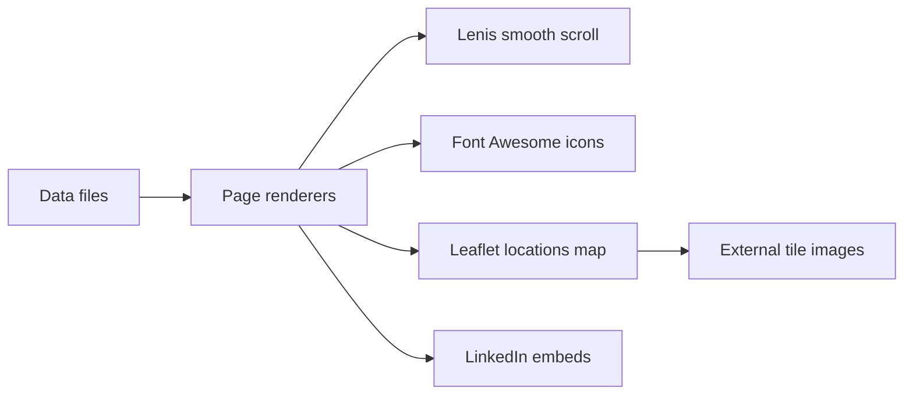

# Tridel Technologies and Plugins Inventory

> Purpose: a deep, plain-English inventory of the technologies, plugins, browser libraries, server packages, external services, browser APIs, data formats, and security controls used by this Tridel website.
> Companion: `TECHNICAL_DOCUMENTATION.md` explains how the whole system works together. This file explains each technology and plugin in detail.

---

## 1. Quick Inventory

| Category | Technology | Used where | Why it exists |
|---|---|---|---|
| Language | HTML5 | `index.html`, `admin.html`, `404.html` | Page shells and semantic structure |
| Language | CSS3 | `assets/css/*.css` | Styling, layout, themes, responsive behavior |
| Language | JavaScript | `assets/js/*.js`, `server.js` | Public rendering, admin logic, local API |
| Runtime | Browser DOM | public site and admin | Interactive UI |
| Runtime | Node.js | `server.js` | Local admin server |
| Server package | Express | npm dependency | Routing, static files, JSON API |
| Server package | CORS | npm dependency | Controlled local cross-origin headers |
| Server core | `crypto` | `server.js` | Password hashing and token generation |
| Server core | `fs` | `server.js` | Local data-file reads and writes |
| Server core | `path` | `server.js` | Safe path construction |
| Browser plugin | SortableJS | `assets/vendor/sortable/Sortable.min.js` | Drag-and-drop ordering in admin |
| Browser plugin | Lenis | `assets/vendor/lenis/lenis.min.js` | Smooth scrolling on public pages |
| Browser plugin | Leaflet | `assets/vendor/leaflet/` | Interactive locations map |
| Icon library | Font Awesome | CDN in HTML | Admin and website icons |
| Font assets | Inter | `assets/fonts/inter/` | UI/body typography |
| Font assets | Outfit | `assets/fonts/outfit/` | Display/brand typography |
| Content embed | LinkedIn posts | news/social sections | Social proof and news embeds |
| Form service | FormSubmit | contact/careers forms | Email delivery without a custom mail server |
| Map tiles | OpenStreetMap/CARTO-style hosts | Leaflet maps | Map backgrounds |
| Hosting headers | `_headers` | static hosting | CSP, cache, robots, security headers |
| IIS headers | `web.config` | IIS/static Windows hosting | Equivalent security and rewrite rules |
| Crawler control | `robots.txt` | static root | Bot and indexer policy |

---

## 2. Design Philosophy

This project is intentionally lightweight.

There is no frontend build step. The browser loads plain JavaScript and CSS directly. That gives the site a low maintenance burden and makes emergency content fixes simple.

There is no database. Content lives in JavaScript data files. The public site reads those files, and the local admin server writes those files.

There is no hosted admin backend. The admin panel is a local tool for trusted maintainers. The deployed website is public/static; the admin editing workflow belongs on the maintainer's machine.

---

## 3. Languages

### 3.1 HTML5

**Where**

- `index.html`
- `admin.html`
- `404.html`

**Role**

HTML files provide the root shell. They load styles, data files, runtime scripts, and placeholder containers.

The public site does most page rendering through JavaScript. The admin shell defines the admin layout, modals, buttons, and script order.

**Maintenance notes**

- Keep script order intentional. Data files must load before page renderers that read them.
- Keep `admin.html` local-only in behavior. It may exist in the deployed file tree, but it must not become a working remote admin.
- Avoid inline secrets.

### 3.2 CSS3

**Where**

- `assets/css/styles.css`
- `assets/css/admin.css`
- `assets/css/admin-auth.css`
- `assets/css/fonts.css`
- vendor CSS under `assets/vendor/leaflet/`

**Role**

CSS controls layout, responsive behavior, dark/light themes, admin forms, product cards, navigation, and page sections.

**Key techniques**

- CSS custom properties for theme colors.
- Media queries for responsive layouts.
- Local `@font-face` declarations for Inter and Outfit.
- Admin-specific styles separated from public site styles.

**Maintenance notes**

- Keep public and admin styles separated.
- Keep button and form states visible.
- Avoid hiding focus outlines unless replacing them with an equally visible focus style.

### 3.3 JavaScript

**Where**

- `assets/js/*.js`
- `assets/js/pages/*.js`
- `server.js`

**Role**

JavaScript is the main application language. Browser scripts render pages, load data, manage admin drafts, validate forms, and initialize plugins. Node.js runs the local admin API.

**Maintenance notes**

- Browser scripts are plain scripts, not modules.
- Most data is global through constants copied onto `window`.
- Syntax should stay compatible with modern evergreen browsers.
- Run `node --check` on browser scripts for syntax validation even though DOM objects are not available in Node.

---

## 4. Server Runtime

### 4.1 Node.js

**Where**

- `server.js`

**Role**

Node runs the local content management server. It serves static files, authenticates admin users, parses data files, writes data files, and records simple metrics.

**How to run**

```powershell
npm install
npm start
```

**Current local URL**

```text
http://localhost:3000
```

**Security note**

The server binds to `127.0.0.1`, so it is intended for the local machine only.

### 4.2 Express

**Where**

- npm dependency in `package.json`
- imported in `server.js`

**What it is**

Express is a small Node.js web framework.

**Why it is used**

Express provides:

- route definitions
- JSON request parsing
- static file serving
- middleware chaining
- concise local API implementation

**Routes it supports**

- authentication routes
- data read/write routes
- metrics routes
- static file serving

**Failure modes**

- If Express is missing, `npm install` has not been run.
- If port `3000` is busy, the server cannot start unless `PORT` is changed.
- If the browser opens the deployed site instead of localhost, admin writes will not work.

### 4.3 CORS

**Where**

- npm dependency in `package.json`
- configured in `server.js`

**What it is**

CORS middleware controls which browser origins may call the local API.

**Why it is used**

It allows controlled local browser calls while preventing broad cross-origin access.

**Maintenance notes**

- Keep the allowlist narrow.
- Do not use `*` for admin routes.
- Localhost and loopback origins should be enough for normal admin use.

### 4.4 Node `crypto`

**Where**

- `server.js`

**What it does**

The server uses Node's `crypto` module for:

- password hashing with `scryptSync`
- random token creation
- salt handling

**Why it matters**

Plain text passwords must never be compared or stored as reusable secrets. The local server validates a password through a derived hash.

### 4.5 Node `fs`

**Where**

- `server.js`

**What it does**

The filesystem module reads and writes the local data files.

**Important rule**

The browser does not choose arbitrary file paths. The server maps known content types to known files.

### 4.6 Node `path`

**Where**

- `server.js`

**What it does**

The path module creates stable filesystem paths across Windows and other environments.

**Why it matters**

Path construction should never rely on string concatenation when writing files.

---

## 5. Browser Plugins and Libraries

### 5.1 SortableJS

**Where**

```text
assets/vendor/sortable/Sortable.min.js
```

**Loaded by**

```text
admin.html
```

**What it is**

SortableJS is a drag-and-drop ordering library.

**Why it is used**

The admin panel has repeated items:

- products
- services
- clients
- team members
- testimonials
- navigation links
- footer links
- home cards

Maintainers expect to reorder those items visually. Native drag-and-drop is inconsistent across browsers, so SortableJS gives a predictable reorder experience.

**How it works here**

1. Admin renders a list.
2. SortableJS is attached to the list container.
3. The user drags a row.
4. The in-memory array order changes.
5. The relevant content type is marked pending.
6. `Save Local Files` writes the reordered array to the local data file.

**Failure mode**

If the script is missing:

- forms still render
- drag handles may not work
- the user can still edit text fields
- ordering may need fallback buttons or manual data edits

**Upgrade notes**

- Replace only `assets/vendor/sortable/Sortable.min.js`.
- Verify reorder in each admin section.
- Run browser smoke tests after upgrading.

### 5.2 Lenis

**Where**

```text
assets/vendor/lenis/lenis.min.js
```

**Loaded by**

```text
index.html
```

**What it is**

Lenis is a smooth-scrolling library.

**Why it is used**

The public site has long visual pages with large sections. Smooth scrolling helps make transitions feel more polished.

**How it works here**

The site initializes smooth scrolling after the main page scripts load. It should behave as an enhancement, not a required dependency.

**Failure mode**

If Lenis fails:

- normal browser scrolling should continue
- the site should remain readable
- the console may show a plugin initialization error

**Upgrade notes**

- Replace `assets/vendor/lenis/lenis.min.js`.
- Test desktop wheel scrolling.
- Test mobile touch scrolling.
- Test hash route navigation after scroll initialization.

### 5.3 Leaflet

**Where**

```text
assets/vendor/leaflet/leaflet.css
assets/vendor/leaflet/leaflet.js
```

**Loaded by**

`assets/js/locations-loader.js` lazy-loads Leaflet when the map is needed.

**What it is**

Leaflet is a browser mapping library.

**Why it is used**

The site needs a locations map without a heavy full-map application framework.

**How it works here**

1. The locations section requests map initialization.
2. `locations-loader.js` loads Leaflet CSS and JS if needed.
3. The script reads `LOCATIONS_DATA`.
4. A Leaflet map is created.
5. Markers are added from the data file.
6. Map tiles are loaded from allowed tile providers.

**External dependencies**

Leaflet itself is vendored locally, but map background tiles are external network requests.

**Failure modes**

- If Leaflet files are missing, the map cannot initialize.
- If tile domains are blocked by CSP or the network, markers may appear over a blank or gray map.
- If `LOCATIONS_DATA` is malformed, markers may fail.

**Upgrade notes**

- Replace both JS and CSS together.
- Test light and dark theme tile behavior.
- Test marker popups.
- Confirm CSP still allows tile hosts.

### 5.4 Font Awesome

**Where**

Loaded from CDN in:

- `index.html`
- `admin.html`

**What it is**

Font Awesome provides icon glyphs through CSS classes such as:

```html
<i class="fas fa-save"></i>
```

**Why it is used**

The project uses icons for:

- admin action buttons
- navigation helpers
- theme toggle
- status labels
- service/product UI details

**Failure mode**

If the CDN is unavailable:

- text remains visible
- icon glyphs may disappear
- layout should not depend on icons alone

**Security note**

The CDN host must remain in `style-src` and `font-src` in CSP if the CDN version is used.

**Local alternative**

For stricter offline operation, vendor the Font Awesome CSS and font files under `assets/vendor/` and update HTML/CSP accordingly.

---

## 6. Fonts

### 6.1 Inter

**Where**

```text
assets/fonts/inter/
```

**Files**

- `Inter-Light.ttf`
- `Inter-Regular.ttf`
- `Inter-Medium.ttf`
- `Inter-SemiBold.ttf`
- `Inter-Bold.ttf`

**Role**

Inter is used for clean UI typography, body text, forms, labels, and admin readability.

### 6.2 Outfit

**Where**

```text
assets/fonts/outfit/
```

**Files**

- `Outfit-Regular.ttf`
- `Outfit-Medium.ttf`
- `Outfit-Bold.ttf`
- `Outfit-ExtraBold.ttf`

**Role**

Outfit is used for stronger display typography, headings, and brand-facing sections.

### 6.3 Font Loading Notes

Fonts are declared in:

```text
assets/css/fonts.css
```

The browser downloads only the weights requested by CSS. Keep font weights limited to avoid unnecessary page weight.

---

## 7. Content Embeds and External Services

### 7.1 LinkedIn Embeds

**Where**

- content data in `assets/js/linkedin-posts.js`
- public renderers/loaders for news/social sections

**What it is**

LinkedIn embeds show selected company/news posts inside the website.

**Why it is used**

It gives visitors fresh proof of activity without building a full news CMS.

**Security and reliability notes**

- Embedded posts are iframes or external widgets.
- CSP must allow the required frame source.
- Browser privacy settings can block third-party frames.
- Embeds should never be the only copy of important content.

**Failure mode**

If LinkedIn is blocked, the surrounding section should degrade gracefully.

### 7.2 FormSubmit

**Where**

Contact/careers forms may submit to FormSubmit endpoints, depending on form configuration.

**What it is**

FormSubmit is a hosted form-to-email service.

**Why it is used**

It avoids maintaining a custom email server in this project.

**Security notes**

- Validate visible form fields client-side for usability.
- Do not rely only on client-side validation for anti-abuse.
- Keep destination emails in `SETTINGS_DATA`, not hard-coded across many templates.

**Failure mode**

If the service is blocked or down, forms may not deliver. The UI should show a clear failure state.

---

## 8. Map Tile Providers

Leaflet needs tile images to show the map background. The code can reference light and dark tile styles from tile hosts such as CARTO/OpenStreetMap-style providers.

**Where**

- `assets/js/locations-loader.js`
- `_headers`
- `web.config`

**Why external tiles are allowed**

The map library is local, but the map background is too large to ship in this repository.

**Maintenance notes**

- Keep tile hosts in CSP `img-src` and `connect-src` when needed.
- Respect each tile provider's usage terms.
- If map tiles stop loading, check CSP first, then browser network tab, then provider availability.

---

## 9. Browser Platform APIs

### 9.1 DOM APIs

Used for:

- rendering sections
- forms
- modals
- navigation
- theme toggles
- admin tables

Common methods:

- `document.getElementById`
- `querySelector`
- `addEventListener`
- `classList`
- `innerHTML`

**Safety note**

Use escaping helpers for untrusted text before inserting it into `innerHTML`.

### 9.2 Fetch API

Used for:

- admin login
- admin session checks
- local data route reads/writes
- reloading local data files

**Important**

All admin save calls go to the local server.

### 9.3 Local Storage and Session Storage

Used for:

- theme preference
- admin session token
- UI state where needed

**Security note**

The admin token is a local session token. Do not store long-lived secrets in browser storage.

### 9.4 History and Hash APIs

Used for:

- public SPA routes
- in-page navigation

Routes use `#/path` so static hosts can serve the same HTML file for all pages.

### 9.5 Intersection Observer

Used where scroll-triggered animations or viewport-based section behavior are needed.

**Failure mode**

Older browsers without Intersection Observer should still show the content, just without enhanced animation behavior.

---

## 10. Data Formats

### 10.1 JavaScript Data Files

Primary content format.

Example:

```javascript
const SERVICES_DATA = [
  {
    id: "survey",
    title: "Survey Services",
    description: "..."
  }
];
```

**Pros**

- No database.
- Easy static hosting.
- Easy browser consumption.
- Versionable as normal project files.

**Cons**

- Requires careful parsing.
- A syntax error can break a section.
- Large files are loaded by the browser.

### 10.2 JSON Payloads

The local admin API sends JSON request bodies:

```json
{
  "type": "products",
  "data": []
}
```

The server converts the JSON payload back into a JavaScript data-file assignment.

### 10.3 Images

The project uses:

- `.png`
- `.jpg`
- `.jpeg`
- `.webp`
- `.avif`
- video assets where product media needs them

**Maintenance notes**

- Compress large images.
- Prefer real product imagery for product pages.
- Avoid broken relative paths in data files.

---

## 11. Security and Policy Controls

### 11.1 Content Security Policy

**Where**

- `server.js`
- `_headers`
- `web.config`

**Purpose**

CSP limits where scripts, styles, images, frames, and network connections may come from.

**Why it matters**

If a page accidentally tries to load an unapproved external script or frame, the browser blocks it.

### 11.2 X-Robots-Tag and Robots Policy

**Where**

- `robots.txt`
- `_headers`
- `web.config`
- page metadata where applicable

**Purpose**

Prevent indexing and reduce crawler access.

**Important distinction**

Robots controls guide crawlers. They are not a replacement for authentication.

### 11.3 Local-Only Admin Boundary

**Where**

- `assets/js/admin-auth.js`
- `server.js`

**Controls**

- Browser host check blocks non-local admin use.
- Server binds to loopback.
- Admin writes require a local session token.

### 11.4 Password Hashing

**Where**

- `server.js`

**Technology**

Node `crypto.scryptSync`

**Purpose**

Avoid plain-text password comparison and reduce risk if a local hash leaks.

---

## 12. Hosting and Server Config Files

### 12.1 `_headers`

**Used by**

Static hosts that understand Netlify-style `_headers`.

**Controls**

- CSP
- cache policy
- crawler policy
- security headers

### 12.2 `_redirects`

**Used by**

Static hosts that understand Netlify-style `_redirects`.

**Controls**

- fallback routing
- hash route support
- static app behavior

### 12.3 `web.config`

**Used by**

IIS-style hosting environments.

**Controls**

- header equivalents
- static fallback routing
- MIME/static handling where configured

---

## 13. Admin-Specific Plugin Flow



The admin panel uses plugins only where they reduce real UI complexity. SortableJS is the main admin UI plugin. Everything else is plain DOM and local API calls.

---

## 14. Public-Site Plugin Flow



Public plugins are progressive enhancements. The website should still display useful content if a plugin or external embed fails.

---

## 15. Dependency Maintenance Guide

### Express

1. Update with `npm install express@latest`.
2. Run `npm start`.
3. Test login, data read, data write, and static serving.
4. Check server logs.

### CORS

1. Update with `npm install cors@latest`.
2. Confirm local admin API calls still work.
3. Confirm remote origins are not accidentally opened.

### SortableJS

1. Replace `assets/vendor/sortable/Sortable.min.js`.
2. Test drag-and-drop in all reorderable admin sections.
3. Save local files and inspect resulting data arrays.

### Lenis

1. Replace `assets/vendor/lenis/lenis.min.js`.
2. Test scroll on desktop and mobile.
3. Test route changes after scrolling.

### Leaflet

1. Replace `assets/vendor/leaflet/leaflet.js`.
2. Replace `assets/vendor/leaflet/leaflet.css`.
3. Test map load, markers, popup content, and theme behavior.
4. Confirm CSP allows tile images.

### Font Awesome

1. Update CDN version in HTML or vendor it locally.
2. Test admin icons and public icons.
3. If CDN host changes, update CSP.

---

## 16. What Is Intentionally Not Used

| Not used | Reason |
|---|---|
| Frontend framework | The site is simple enough for plain JavaScript |
| Bundler | Static file loading is transparent and easy to host |
| Database | Data files are enough for current content volume |
| Hosted CMS | Admin is local-only by design |
| Remote repository API in admin | Admin saves local files only |
| Client-side secrets | Public browser files cannot safely hold secrets |
| Heavy map platform SDK | Leaflet is enough for location markers |

---

## 17. Recommended Checks After Plugin Changes

```powershell
node --check server.js
node --check assets/js/admin-auth.js
node --check assets/js/admin.js
node --check assets/js/admin-publish.js
git diff --check
```

Manual browser checks:

- Home page renders.
- Products page renders.
- Services page renders.
- About page renders.
- Contact page renders.
- Locations map initializes.
- Admin login works on localhost.
- Admin refuses non-local use.
- Drag-and-drop still updates order.
- `Save Local Files` writes local data files.
- LinkedIn embeds fail gracefully if blocked.
- Form links/buttons still go to the expected destination.

---

## 18. Plain-English Mental Model

Think of the system like this:

The public website is a static showroom. Its products, services, clients, stories, and layout come from local JavaScript data files.

The admin panel is a local workshop. It edits those same data files through a small server running on the maintainer's machine.

Plugins are tools inside the showroom and workshop:

- SortableJS helps the workshop reorder content.
- Lenis makes the showroom scroll smoothly.
- Leaflet powers the showroom map.
- Font Awesome supplies icons.
- LinkedIn embeds show selected social/news content.
- FormSubmit can deliver form messages.

The security model is simple: public visitors get the showroom; maintainers run the workshop locally.
